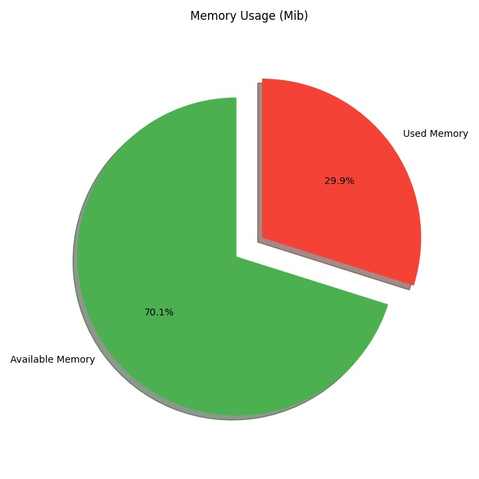
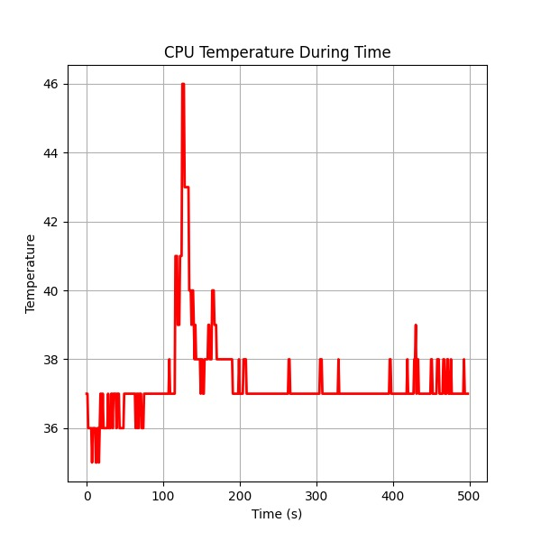
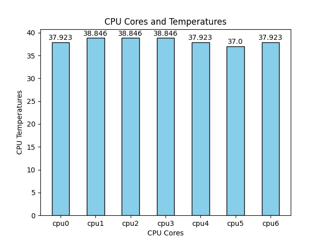

# CoreSense

CoreSense, Linux tabanlı sistemler için geliştirilmiş, donanım izleme ve koruma odaklı özel bir **systemd servisidir**.

## 🚀 Özellikler
- Gerçek zamanlı CPU sıcaklık takibi
- RAM ve CPU kullanım verilerinin periyodik olarak loglanması
- PyTorch’ta eğitilip **ONNX** formatına dönüştürülmüş **LSTM** modeli ile CPU sıcaklığı üzerinde **anomali tespiti** ve anomalilerin loglanması
- CPU ve donanıma zarar verebilecek **kritik sıcaklıklarda** sistemin koruma moduna alınması ve bu durumların kayıt altına alınması
- **systemd servisi** olarak arka planda kesintisiz çalışma
- Özel olarak geliştirilmiş **CLI komutları** ile:
  - Anlık RAM kullanımının görselleştirilmesi
  - Zaman içerisinde CPU sıcaklığının değişiminin görselleştirilmesi
  - CPU üzerindeki tüm çekirdeklerin anlık sıcaklıklarının görselleştirilmesi
- Python **sanal ortam (venv)** desteği

## 🚀 Kurulumlar

Github üzerinden servisin bulunduğu repo indirilir.
```
git clone https://github.com/HalilHuseyinCaliskan/CoreSense.git
cd CoreSense/scripts
```
Bash dosyasına yürütme izni verilir ve çalıştırılır.
```
chmod +x permissions_and_cli.sh
./permissions_and_cli.sh
```
RAM kullanımının görselleştirilmesi için geliştirilmiş CLI komutu.
```
memory_pie
```


CPU sıcaklığının zaman içindeki değişimini görselleştirilmesi için geliştirilmiş CLI komutu.
```
cpu_thermal
```


CPU sıcaklığının her bir çekirdeğe göre anlık görselleştirilmesi için geliştirilmiş CLI komutu.
```
cpu_cores_thermal
```


CPU sıcaklığındaki anomalilere ait log dosyası.
```

cat $HOME/cpu_directory/anomali.log
```
RAM'deki kullanılabilir ve kullanılamaz bellek alanlarına ait log dosyası.
```
cat $HOME/memory_directory/memory.log
```

## 🚀 Önemli Notlar
Servis dosyalarında **User** kısmına sisteminizdeki kullanıcı adını ve **home** adresini sisteminizdeki home adresini veriniz.
